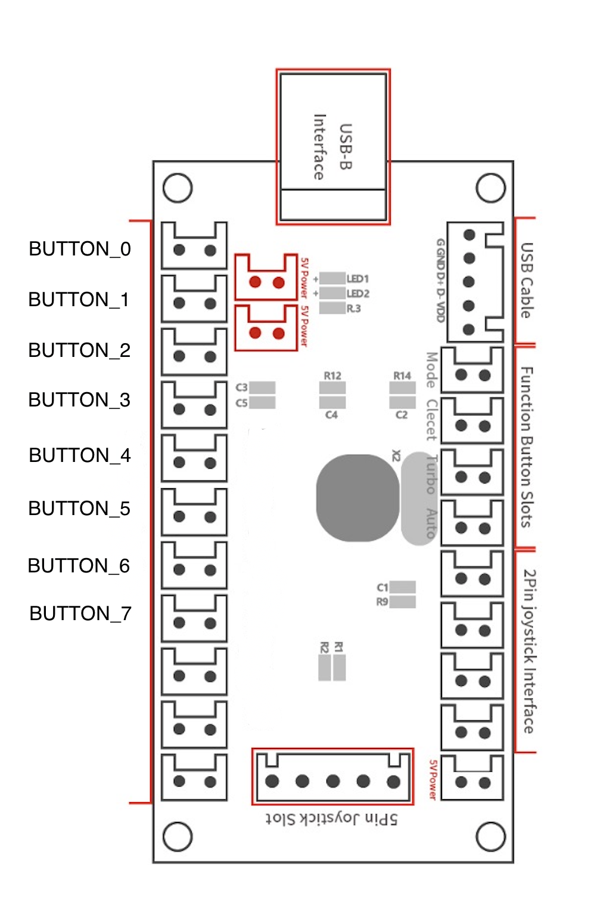
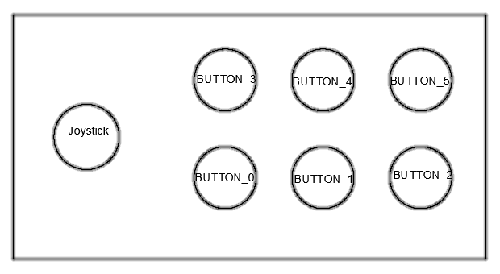
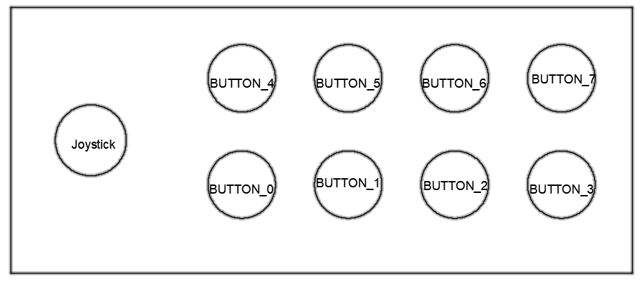

# Plugin MAME Input LEDs Controller Plugin

This plugin is meant for setup using cheap board like zero delay.
If you have a fancy board like I-PAC Ultimate I/O or a LED controller check those software:

- Windows: [LED Blinky](https://www.ledblinky.net/)
- Rasperry Pi: [RGB Commander](http://users.telenet.be/rgbcommander/)
- Linux: [LED Spicer](https://sourceforge.net/p/ledspicer/wiki/Home/)

## Wiring

Should work this anyboard just follow the same pricipal


If you have less buttons it should works too just follow the same pricipal



_Technically right now the buttons wiring doesn't matter as i don't change anything but hopefully soon i will remap the buttons layout base on the game specificity_

[Server side wiring](/rpi-server#Wiring)

## Install

- Move folder `milcp` from `mame/plugins` inside your mame `plugins` folder
- Set your server IP in `milcp/constants.py`

Open PowerShell (shift + right click)

```
python # will open windows store, click Get

# when install is done do:
pip install requests
```

## Server

- [Setup Raspberry Pi](/rpi-server)

## Supported Games

- [List Supported Games](SupportedGames.md)

## Demo

[Youtube link](https://www.youtube.com/watch?v=P2EGnTRAedU)

## Issues

- When using MAME UI game window get minimize, working fine in command line and CoinOPS NEXT

## TODO

- Use mosfets instead of relays
- Improve ugly wiring diagram (all the drawing are ugly tbh)
- MAME seems to know how many buttons the game use, investigate that
- Find a way set the game input configuration from the lua plugin
- Find a way to go the http request directly from the lua plugin
- Use .bat script instead of python in MAME plugin
- Parse http query and display to user if error
- If game pause make start button blink
- If no coins make coins button blink
- Support more input layouts
- Add support for ServoStik joystick
- Server: ctrl + c not handled
- Server: if game unknown light all leds
- Server: create a http server without using `flask`
- Server: add env variables to only light up player inputs based on game number of players
- Server: having issue install dependencies for Pi B+, works for Zero W and 3B
