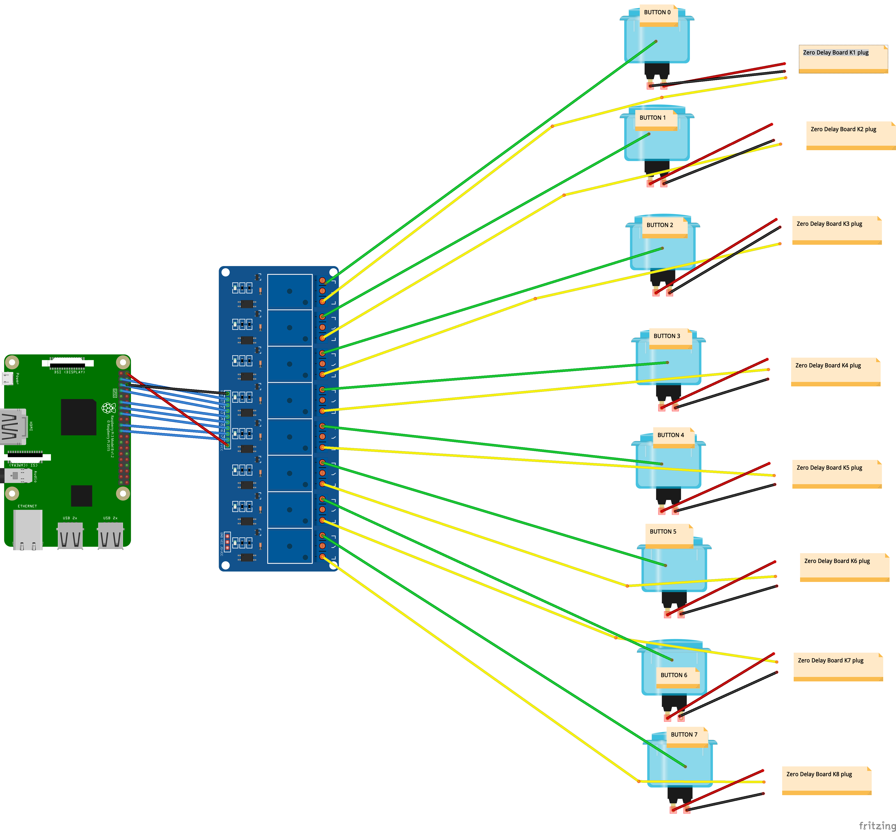

# Server For MAME Input LEDs Controller Plugin

## Wiring

_Ugly relay schema_


## Install

In terminal type:

```
sudo apt-get update
sudo apt-get install rpi.gpio

# install PIP
# check python version
python --version

# for python v2.*
sudo apt-get install python-pip
# for python v3.* (not tested with python 3)
sudo apt-get install python3-pip

pip install flask
```

- start server
- setup auto start https://stackoverflow.com/questions/51025893/flask-at-first-run-do-not-use-the-development-server-in-a-production-environmen

## Usage

By defaults when no game is running all the LEDs will be turn on.
If you want the default behaviour do be all the LEDs off set the env variable `LED_DEFAULT_VALUE` to `OFF`

If after wiring everything and trying the plugin yours LEDs behave the opposite of what they should, that mean your relay use `HIGH` to let the current though and `LOW` to block it. After some research i found that the most common behaviour is the opposite. To fix this issue set the env variable `MY_RELAY_IS_REVERSE` to `FALSE`

Start server

```
python server.py
```

## API

```
# Set LEDs behaviour for playing game
POST /game/<romname>
# Body
{
  inputs: Array<string>
}
# Return
{
  success: boolean
  message: string # set only if success if false
}

# Reset all LEDs to default behaviour
DELETE /game/<romname>
# Body
{}
# Return
{
  success: boolean
  message: string # set only if success if false
}

# Debug request body
POST /debug
# Body
{
  *
}
# Return
{
  success: boolean
  message: string # set only if success if false
}
```
