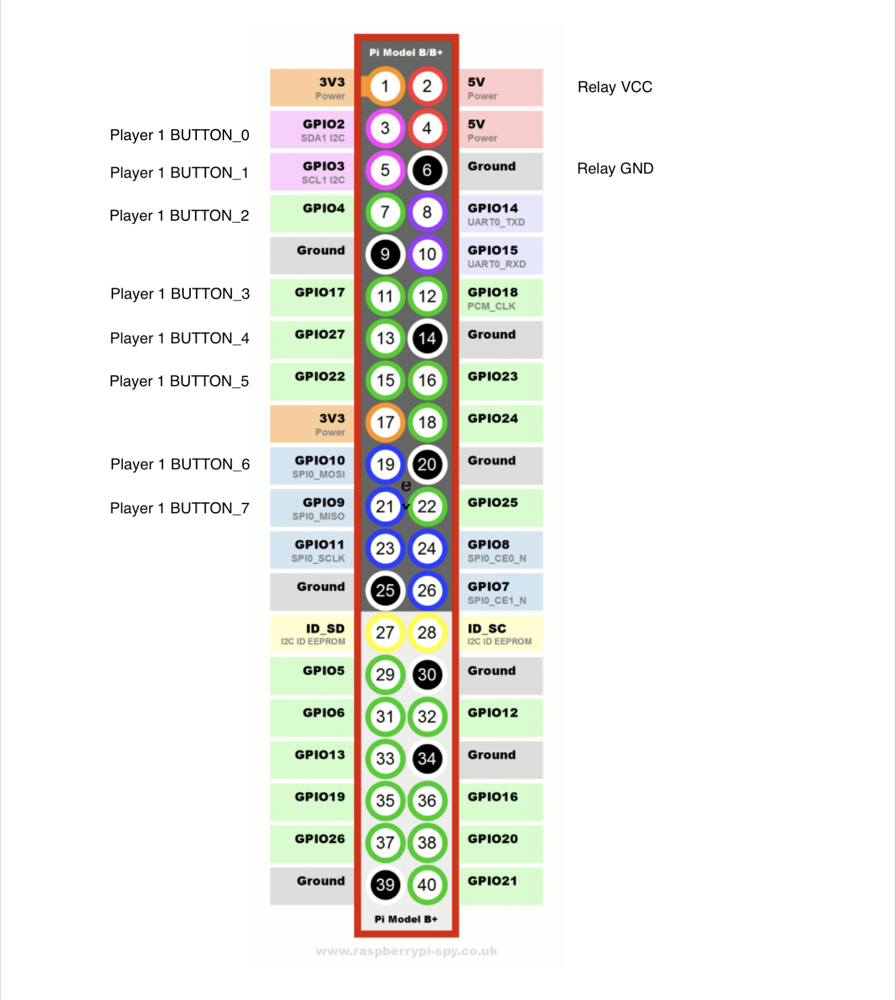
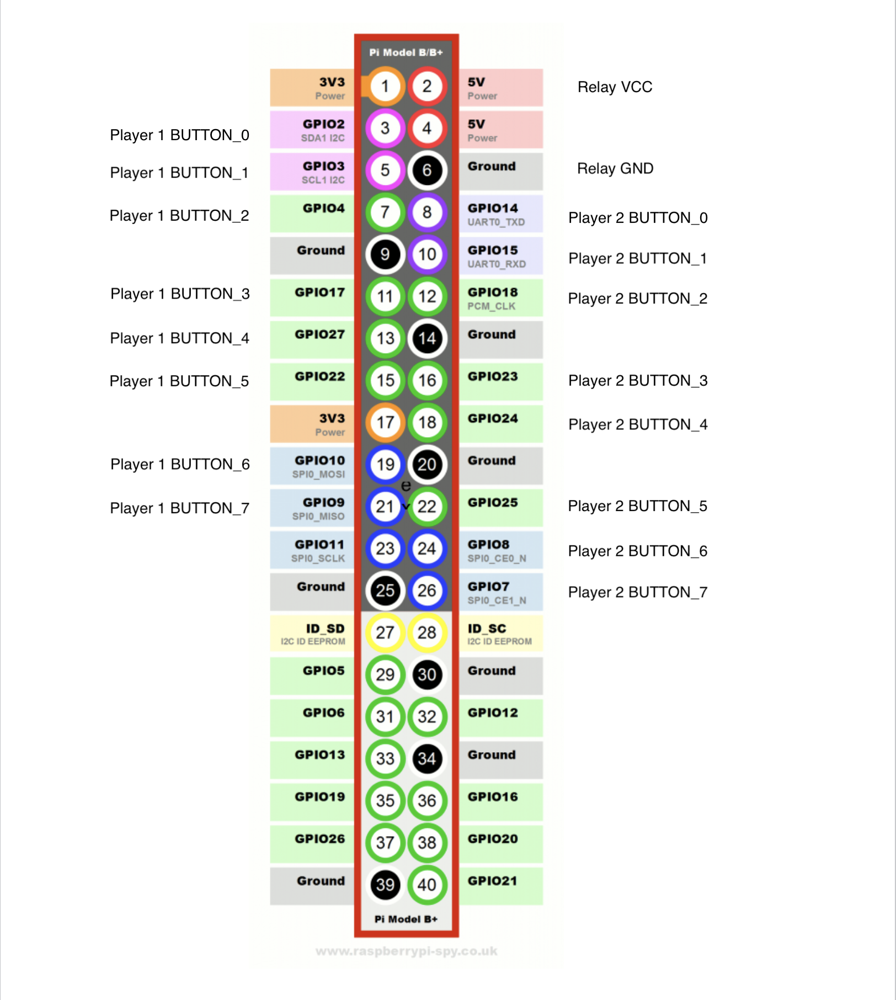
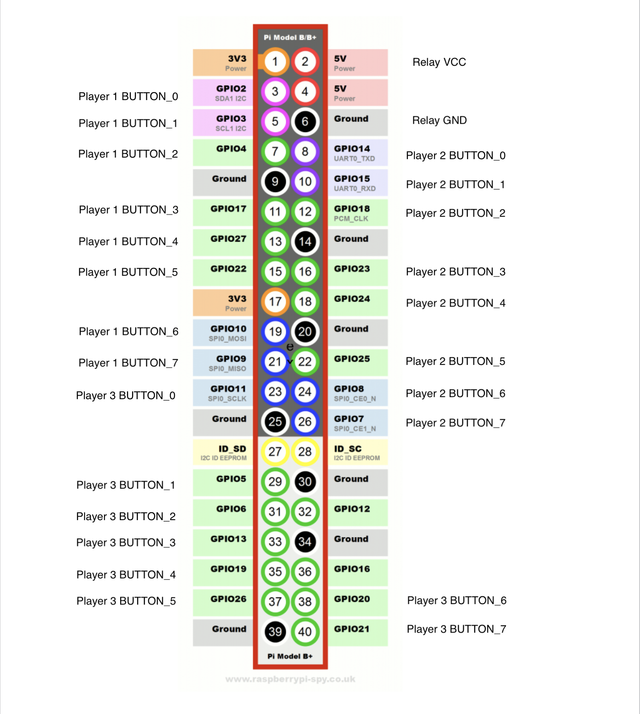

# Server For MAME Input LEDs Controller Plugin

## Wiring

### Relay wiring

_Ugly relay schema_


You actually don't need to return the ground wire to the board, you can daisy chaine them to 1 button. In setup I use button 0 ground wire as gound for button 1, 2 and 3, and button 4 ground for button 5, 6 and 7.

At the moment you need 1 relay for each button, so if you have 2 players with 8 buttons each you need 16 relay. If you don't care about about display only playable player you can reuse the same relay for different player.
I'm working on a way to only use 1 more relay for extra player, the code is done but haven't been hable to make the wiring works, it may not be possible.

### Raspberri Pi pins wiring to relay

If you use less buttons just ignore the pins.
If you need more configuration just ask i will add them ;)
The Pi can control up to 26 relays.

_1 player 8 buttons pins_


_2 player 8 buttons pins_


_3 player 8 buttons pins_


## Install

In terminal type:

```
sudo apt-get update
sudo apt-get install rpi.gpio

# install PIP
# check python version
python --version

# for python v2.*
sudo apt-get install python-pip
# for python v3.* (not tested with python 3)
sudo apt-get install python3-pip

pip install flask
```

- start server
- setup auto start https://stackoverflow.com/questions/51025893/flask-at-first-run-do-not-use-the-development-server-in-a-production-environmen

## Usage

By defaults when no game is running all the LEDs will be turn on.
If you want the default behaviour do be all the LEDs off set the env variable `LED_DEFAULT_VALUE` to `OFF`

If after wiring everything and trying the plugin yours LEDs behave the opposite of what they should, that mean your relay use `HIGH` to let the current though and `LOW` to block it. After some research i found that the most common behaviour is the opposite. To fix this issue set the env variable `MY_RELAY_IS_REVERSE` to `FALSE`

To choose your controller configuration set the env variable `VERSION` by default the value is `TWO_PLAYERS_THREE_BUTTONS`.
List of possible configuration:

- `ONE_PLAYER_EIGHT_BUTTONS`
- `TWO_PLAYERS_THREE_BUTTONS`
- `TWO_PLAYERS_EIGHT_BUTTONS_COMPLEX` # WIP
- `THREE_PLAYERS_EIGHT_BUTTONS`

Start server

```
python server.py
```

## API

```
# Set LEDs behaviour for playing game
POST /game/<romname>
# Body
{
  inputs: Array<string>
  nbPlayers: integer
}
# Return
{
  success: boolean
  message: string # set only if success if false
}

# Reset all LEDs to default behaviour
DELETE /game/<romname>
# Body
{}
# Return
{
  success: boolean
  message: string # set only if success if false
}

# Debug request body
POST /debug
# Body
{
  *
}
# Return
{
  success: boolean
  message: string # set only if success if false
}
```
